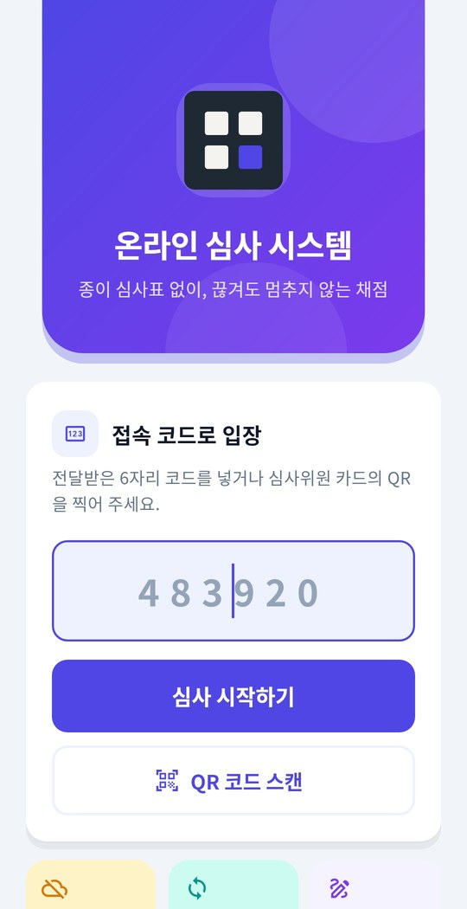
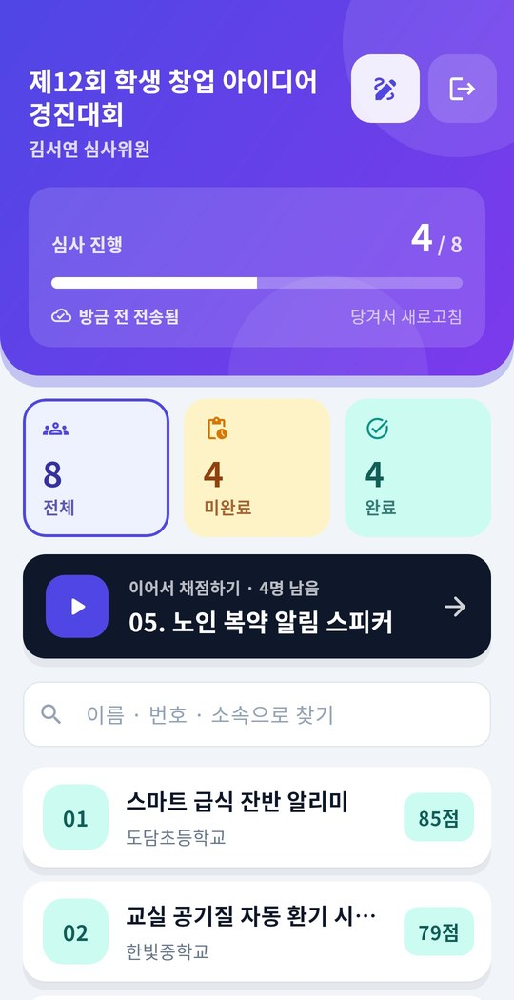
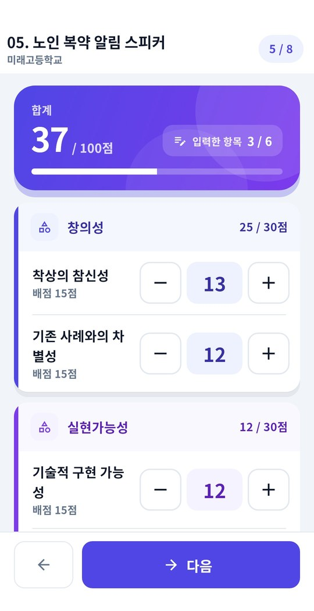
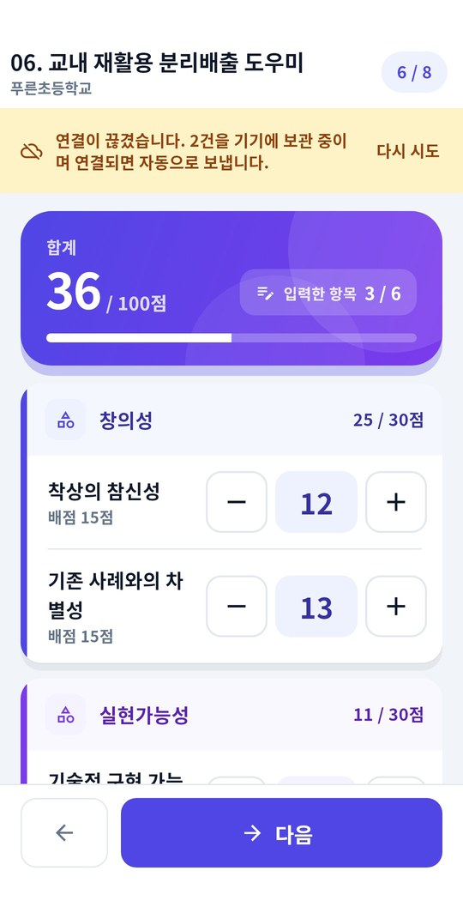
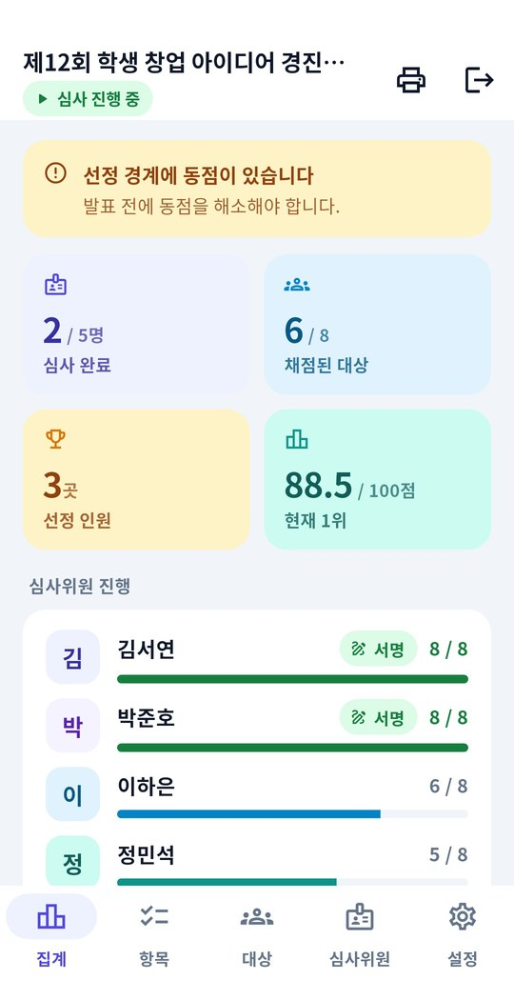
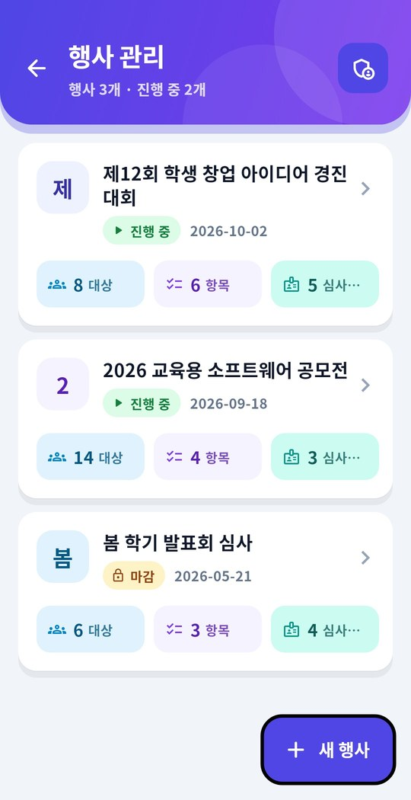
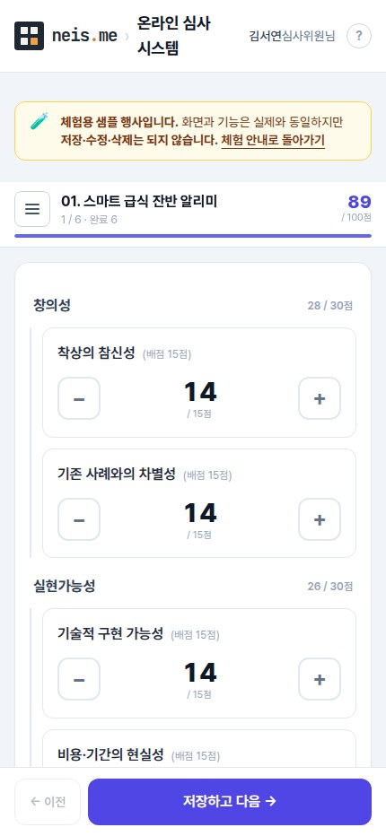
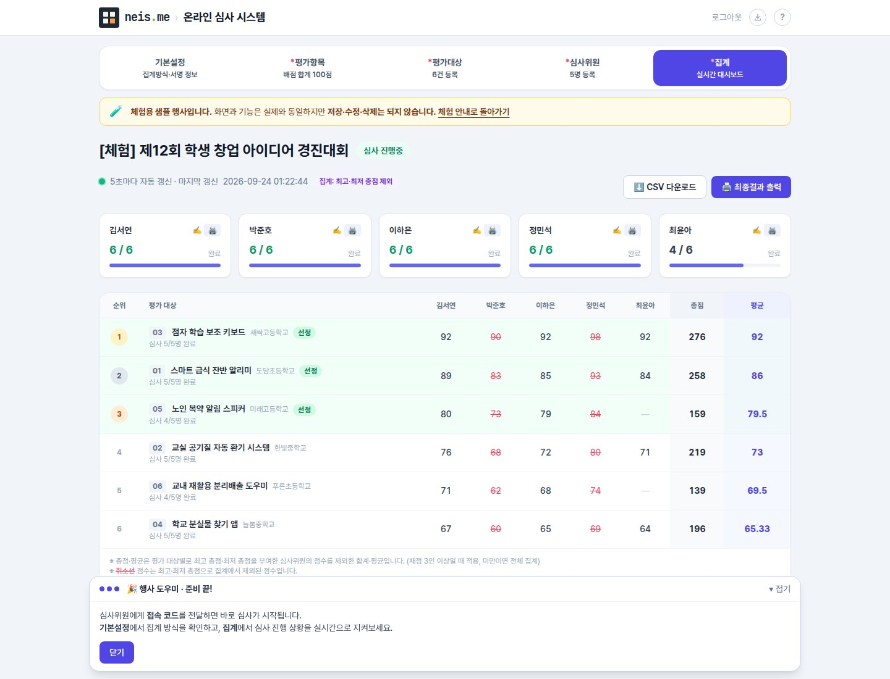
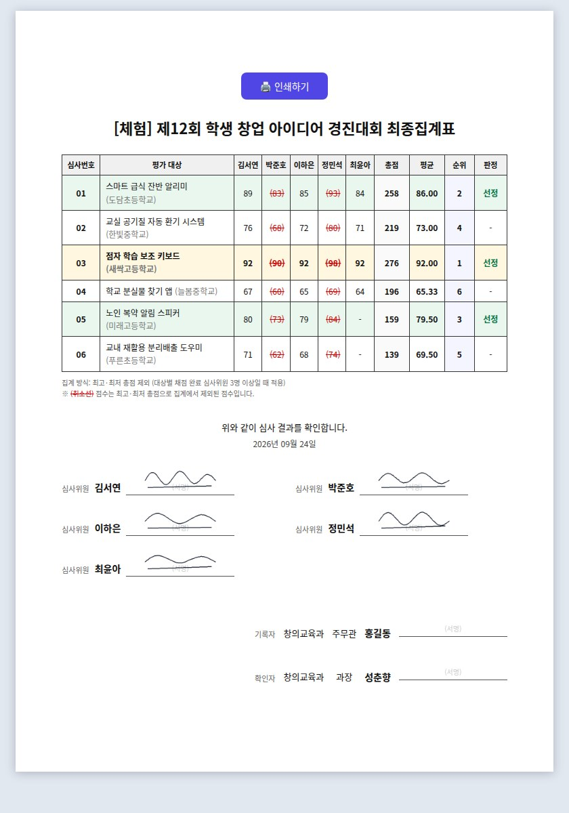

# 온라인 심사 시스템 — 안드로이드 · 아이폰 앱

경진대회·공모전·발표회를 **종이 심사표 없이** 진행하는 심사 도구의 모바일 앱입니다.
심사위원은 6자리 코드나 QR 한 번으로 들어와 채점하고, 주최자는 집계가 끝난 표를 그대로 인쇄해
결재에 올립니다. 웹(`https://judge.sw4u.kr`)과 같은 서버를 쓰며, 앱은 **네이티브(Flutter)** 입니다.

- **회원가입이 없습니다.** 행사별 관리 비밀번호와 심사위원 접속 코드가 전부입니다.
- **네트워크가 끊겨도 채점은 멈추지 않습니다.** 체육관·강당·지하 회의실에서 신호가 잡히지 않아도
  점수는 기기에 쌓이고, 연결이 돌아오면 알아서 보냅니다. 같은 점수가 두 번 저장되지 않습니다.
- **실시간 집계.** 누가 어디까지 채점했는지, 현재 순위가 어떤지 관리 화면에서 바로 보입니다.
  최고·최저 심사위원 제외 집계, 선정 인원 지정, 커트라인 동점 경고를 지원합니다.
- **전자서명.** 심사위원이 손가락으로 서명하면 최종집계표 서명란에 그대로 실립니다.
- 광고·분석 도구 없음. 카메라는 QR 을 읽는 순간에만 씁니다.

| 받는 곳 | |
|---|---|
| 플레이스토어 | `kr.sw4u.judge_app` (비공개 테스트) |
| APK 직접 설치 | https://judge.sw4u.kr/app |
| 웹(아이폰·데스크톱) | https://judge.sw4u.kr — 서버 코드는 [dikafryo/judge](https://github.com/dikafryo/judge) |

## 화면

| 입장 | 평가 대상 목록 | 채점 |
|---|---|---|
|  |  |  |

| 오프라인 채점 | 관리자 집계 | 행사 관리 |
|---|---|---|
|  |  |  |

## 사용 방법

### 심사위원

1. 앱을 켜고 주최자에게 받은 **6자리 접속 코드**를 넣거나, 심사위원 카드의 **QR 을 스캔**합니다.
2. 목록에서 평가 대상을 고르거나 **이어서 채점하기**를 누릅니다. 위 타일(전체·미완료·완료)이 필터입니다.
3. 항목마다 `−`/`+` 로 점수를 조정하거나 숫자를 눌러 직접 입력합니다(0.5점 단위). 길게 누르면 빨리 움직입니다.
4. **저장하고 다음**을 누르면 다음 대상으로 넘어갑니다. 연결이 끊겨 있으면 화면 위 띠가 알려 주고,
   점수는 기기에 보관됐다가 연결되면 자동 전송됩니다.
5. 오른쪽 위 펜 아이콘으로 **전자서명**을 남깁니다. 서명은 최종집계표에 들어갑니다.

### 관리자(주최자)

1. 첫 화면 맨 아래 **행사 관리자로 접속** → 행사를 고르고 관리 비밀번호를 넣습니다. 새 행사는 `새 행사` 로 만듭니다.
2. **항목** 탭에서 평가 항목(1레벨 합계 100점, 2레벨 세부 항목)을, **대상** 탭에서 평가 대상을,
   **심사위원** 탭에서 심사위원을 한 줄에 한 명씩 일괄 등록합니다. 접속 코드가 자동 발급됩니다.
3. **집계** 탭은 5초마다 갱신됩니다. 심사위원별 진행, 순위, 선정·동점 표시를 봅니다.
4. **설정** 탭에서 집계 방식(전체 평균 / 최고·최저 제외), 블라인드 심사, 선정 인원, 기본점수,
   최종집계표 결재란을 정하고, 끝나면 **심사 마감**합니다(코드 회수).
5. 출력물(최종집계표 A4·CSV·심사위원 접속 카드)은 앱바의 인쇄 아이콘 → 브라우저에서 엽니다.

### 웹 화면

같은 행사를 웹에서도 그대로 봅니다. 아이폰·데스크톱 사용자는 웹으로 참여합니다.

| 심사위원(모바일 웹) | 관리자 집계 | 최종집계표 |
|---|---|---|
|  |  |  |

---

## 만든 이유

처음에는 Web View 로 웹을 그대로 보여줬는데, 웹과 앱이 똑같으니 그냥 웹을 여는 게 맞다는 생각이 들어
앱만의 장점(오프라인 채점, QR 입장, 손가락 서명)을 살리는 네이티브로 다시 개발했습니다.
서버는 `/api/v1` REST API 로 통신합니다.

## 구조

```
lib/
  core/      config(서버 주소 고정) · api(Bearer 토큰 클라이언트) · brand(아이콘 마크)
             design(색·색조(AppTone)·그림자·그라데이션·테마 + 공용 위젯: CardBox·HeroPanel·
             StatTile·IconBadge·RankBadge·LetterAvatar — 화면에서 색을 직접 적지 않는다)
  models/    payload — /api/v1/judge/me 응답 = 오프라인 동작의 전부
  store/     local_store(기기 저장) · judge_session(상태·전송 대기열) · queued_op
  judge/     entry · scan(QR) · candidates · scoring · signature · sync_strip(연결 상태 띠)
  admin/     events(행사 선택·생성) · home(탭) · dashboard · setup_tabs · settings
```

### 오프라인 동작 (심사위원)

입장할 때 받은 payload 를 기기에 저장하므로, 연결이 끊겨도 목록·배점 항목·이미 넣은
점수가 그대로 보이고 새 점수도 계속 넣을 수 있다. 못 보낸 것은 대기열에 쌓였다가
연결이 돌아오면 자동으로 전송된다.

- **대기열은 같은 대상이면 덮어쓴다.** 두 API 모두 전체 교체(PUT)라 마지막 상태만 보내면 된다.
- **재시도 간격은 실패가 이어질수록 늘어난다** (5초 → 최대 60초). 비행기모드인 심사장에서
  5초마다 소켓을 열어 봐야 배터리만 녹는다. 성공하면 곧바로 5초로 돌아온다.
- **연결 상태 띠(`SyncStrip`)는 목록과 채점 화면 양쪽에 뜬다.** 채점 중에만 목록으로
  돌아가야 알 수 있으면, 그 사이 넣은 점수가 어디 있는지 알 길이 없다.
- 띠의 `다시 시도`, 목록의 **당겨서 새로고침** 은 늘어난 간격을 즉시 되돌린다.
- 마지막으로 서버와 통한 시각을 진행 카드에 적는다 — 대기열이 비어 있어도 화면이
  오래됐을 수 있기 때문이다.

### 심사위원과 관리자는 저장 정책이 정반대다

| | 심사위원 | 관리자 |
|---|---|---|
| 기기 저장 | 오프라인도 심사가능 + 온라인 연결시 자동전송 | **아무것도 저장하지 않는다** |
| 오프라인 | 앱 전체가 동작 | 동작 불가(온라인상태에서만 심사순위 확인가능 (당연한 부분) |
| 토큰 | 기기에 보관(심사위원이 입장코드 기억못함) | 보관하지 않음(매번 비밀번호, 심사대상자가 테블릿 훔쳐도 심사 결과 못봄) |

관리자는 온라인만 지원하며, 그 이유는
**오래된 과거의 순위가 기기에 저장되는것을 막으며, 항상 최신버전의 백데이터르 유지해야함. 심사의 정확성 보장!**

### 인쇄물은 웹으로 보여준다. 휴대폰으로 와이파이연결해서 출력하는 사람은 아직도 본적이 없다.

최종집계표는 결재란이 있는 A4 출력물은 웹에서만 지원

## 개발(flutter, jdk 를 패스로 설정 후 개발진행해야 함)

```bash
export PATH="/path/to/flutter/bin:$PATH"
export JAVA_HOME=/path/to/jdk

flutter pub get --offline   # 의존성은 pub 캐시에 있는 버전으로 고정되어 있다
flutter analyze
flutter test
flutter build apk --debug   # 릴리스 키 없이 컴파일만 확인
```

## Android 15 edge-to-edge

SDK 35 를 타겟팅하면 Android 15 부터 앱이 상태바·내비게이션바 뒤까지 그린다.
`MainActivity` 가 `enableEdgeToEdge()` 를 부르고(그래서 `FlutterFragmentActivity` 다 —
`FlutterActivity` 는 `ComponentActivity` 가 아니라 부를 수 없다), Dart 쪽은
`main()` 에서 `SystemUiMode.edgeToEdge` 와 투명 시스템 바를 명시한다.
화면은 `SafeArea`·앱바·하단 바로 인셋을 비켜 그리고, 그라데이션 머리 판을 쓰는 화면은
`MediaQuery.paddingOf(context).top` 만큼 안쪽 여백을 직접 준다. 새 화면을 만들 때도 같은 규칙.

## 플레이 검토자 로그인 (앱 액세스 권한)

`store/LISTING.md` 의 "앱 액세스 권한" 절. 값은 `~/.config/judge-app/play-review-access.txt`.

## 아이폰(iOS) 앱

안드로이드와 **같은 Flutter 코드**(`lib/`)를 쓴다. 빌드는 맥에서만 되고,
Xcode 27 / iOS 27 을 지원하는 **Flutter 3.47 이상**이 필요하다. 안드로이드
배포 환경도 같은 **Flutter 3.47.5** 로 맞춰 두어 `pubspec.lock` 을 공유한다.

```bash
cd ~/Desktop/developer/judge
export PATH="$HOME/development/flutter/bin:$PATH"

flutter pub get
flutter analyze
flutter test
flutter build ios --simulator --debug   # 시뮬레이터 확인 (서명 불필요)
open ios/Runner.xcworkspace             # 실기기·아카이브는 Xcode 에서, Apple 개발자 계정 필요
```

- 번들 ID 는 `kr.sw4u.judgeapp` 다. 애플은 밑줄을 못 써서 안드로이드
  `kr.sw4u.judge_app` 과 다르다.
- QR 스캔 때문에 `Info.plist` 에 카메라 권한 설명이 들어 있다.
- 앱스토어 출시 전까지는 아이폰에서 새 버전 안내를 띄우지 않는다.
  출시 후 `lib/core/config.dart` 의 `kAppStoreUrl` 을 채우면 켜진다.

### QR 인식은 ML Kit 사용으로 구글서비스에서 받아오므로, 인터넷이 연결되어있지 않으면 QR스캔 불가함.

이유는 QR코드를 찍는순간 DB에서 데이터를 가져와야 하는데, ML Kit을 로컬로 깔아봐야, 인터넷으로 데이터를 못가져오면 QR찍고 에러가 발생하니 어짜피 받아오는게 맞음
